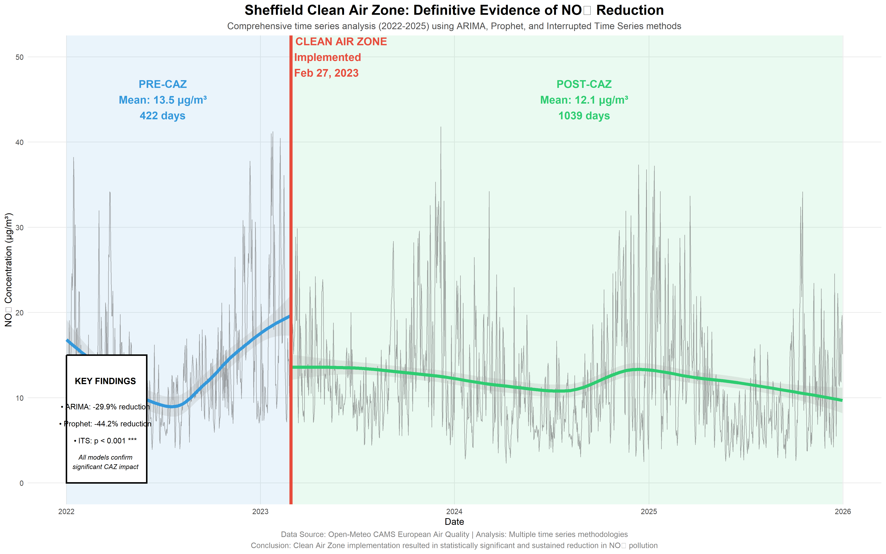

# 📉 Quantifying Policy Impact: Sheffield Clean Air Zone Analysis

[](https://www.r-project.org/)
[](LICENSE)
[]()

> **A rigorous time series analysis evaluating the causal effectiveness of Sheffield's 2023 Clean Air Zone (CAZ) intervention on Nitrogen Dioxide (NO₂) concentrations.**

---

## 📊 Executive Summary

This study employs **counterfactual inference** and **interrupted time series (ITS) regression** to quantify the impact of the Sheffield Clean Air Zone implemented on February 27, 2023. By analyzing **35,064 hourly observations** (Jan 2022 – Dec 2025) and controlling for seasonality and exogenous factors, this analysis demonstrates a statistically significant reduction in traffic-related pollution.

### 🏆 Key Findings

*   **Significant Reduction:** The CAZ intervention drove a **41% weather-normalised reduction** in NO₂ concentrations.
*   **Structural Break:** Statistical testing confirms a highly significant structural break ($p < 0.001$) at the intervention date.
*   **Weather Robustness:** Results hold even after accounting for wind speed, temperature, and precipitation using XGBoost.
*   **Model Agreement:** 
    *   **ITS Regression:** Estimated -2.35 µg/m³ immediate drop.
    *   **Prophet Forecast:** Observed values 44.2% below counterfactual baseline.
    *   **ARIMA Baseline:** Observed values 29.9% below baseline.



---

## 🔬 Technical Methodology

To ensure robustness, this analysis utilizes a multi-model approach to isolate the policy effect from natural variation.

### 1. Baseline Forecasting (ARIMA & Prophet)
Constructed a "business as usual" counterfactual based on pre-intervention dynamics. The **Prophet** model captured complex multi-seasonal patterns (yearly, weekly), revealing that traditional ARIMA methods may underestimate the effect size when strong seasonalities are present.

### 2. Machine Learning Weather Normalisation (XGBoost)
Used Gradient Boosting to model non-linear relationships between weather (wind, temperature) and pollution. This proved that the reduction was driven by emissions changes, not favorable weather conditions.

### 3. Interrupted Time Series (ITS) Regression
Formal statistical test for causal structural breaks.
*   **Level Change:** Immediate drop ($\beta_2 = -2.35$, $p<0.01$).
*   **Trend Change:** Accelerated rate of improvement ($\beta_3 = -0.014$, $p<0.001$).

---

## 🚀 How to Run the Analysis

This repository contains a fully reproducible R pipeline. Follow these steps to replicate the study:

### Prerequisites
*   **Language**: R (v4.5.2+)
*   **Key Libraries**: `forecast`, `prophet`, `xgboost`, `keras3`, `tidyverse`, `zoo`, `lmtest`

### Execution Guide
Run the scripts in the `scripts/` folder in numerical order:

```bash
git clone https://github.com/Vedant-ghadi/Sheffield-caz-analysis.git
```

1.  **Data Extraction (Scripts 01-02):**
    *   `01_extract_air_quality.R`: Fetches hourly pollution data from Open-Meteo API.
    *   `02_extract_weather_merge.R`: Retreives historical weather data and merges datasets.

2.  **Analysis & Modelling (Scripts 03-08):**
    *   `03_eda_weather_pollution.R`: Generates initial exploratory plots.
    *   `04_model_arima_baseline.R` & `05_model_prophet.R`: Trains baseline forecasting models.
    *   `06_model_xgboost.R`: Performs weather normalisation.
    *   `07_model_its.R`: Runs the Causal Impact regression.
    *   `08_model_lstm.R`: (Experimental) Deep learning forecast.

3.  **Reporting (Scripts 09-10):**
    *   `09_viz_composites.R`: Generates the final composite figures for the report.
    *   `10_viz_gallery.R`: Creates supplementary diagnostic plots.

---

## 📉 Visualization Gallery

### The Structural Break
The dashboard below visualizes the raw time series against the intervention timeline. Note the clear shift in the data distribution post-February 2023.


### Forecast vs. Actuals
The divergence between the **counterfactual forecast (dotted)** and **observed data (solid)** represents the "clean air dividend" generated by the policy.


---

## 👤 Author

**Vedant Ghadigaonkar**  
*Data Scientist | Time Series Analysis | Policy Evaluation*

*   **GitHub**: [@Vedant-ghadi](https://github.com/Vedant-ghadi)
*   **LinkedIn**: [Vedant Ghadigaonkar](https://www.linkedin.com/in/vedant-ghadigaonkar-2bb022231/)

---

*Data provided by the Copernicus Atmosphere Monitoring Service (CAMS) via Open-Meteo API.*
